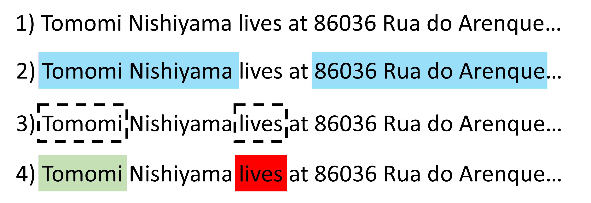

```{r, include = FALSE}
knitr::opts_chunk$set(
  collapse = TRUE,
  comment = "#>"
)
library(dplyr)
library(purrr)
library(tidyr)
library(knitr)

if (requireNamespace("kableExtra", quietly = TRUE)) {
  library(kableExtra)
  knitr::opts_knit$set(
    kable.force.latex = FALSE
  )
  options(knitr.table.format = "html")
  
  local({
    hook_output <- knitr::knit_hooks$get("output")
    knitr::knit_hooks$set(output = hook_output)
  })
  
  knit_print.data.frame <<- function(x, ...) {
    knitr::asis_output(
      kableExtra::kable_styling(
        knitr::kable(x, format = "html"),
        bootstrap_options = c("striped", "hover"),
        full_width = FALSE
      )
    )
  }
  knit_print.tbl_df <<- knit_print.data.frame
  registerS3method("knit_print", "data.frame", knit_print.data.frame, envir = asNamespace("knitr"))
  registerS3method("knit_print", "tbl_df", knit_print.data.frame, envir = asNamespace("knitr"))
  registerS3method("knit_print", "tbl", knit_print.data.frame, envir = asNamespace("knitr"))
  registerS3method("knit_print", "grouped_df", knit_print.data.frame, envir = asNamespace("knitr"))
}

```

```{r setup}
library(pidpos)
```

The pidpos package is intended to be model agnostic - depending on the level of technical skill and 
overhead the user wishes more complex models can be used for the underlying natural language processing (NLP).
However, for the user to be informed as to the improvement for technical investment, we supply a broad characterisation of several models.

Here we present out of the box tagging for a synthetic data set drawn from a openly available `presidio-research` data set [synth_dataset_v2]().  The data set consists of free text with associated tagged entities.  The challenge,
how well does each model provided perform on this data and are there edge cases, common flaws, or preprocessing steps that effect performance.
   
## Data set, Models and Metrics

### Data set

The total data set (included in the package as `presidio_text`) consists of 1500 passages of free text and a total of 2,863 named entities.  The entity break down is:

``` {r}
presidio_tags |>
  group_by(entity_type) |>
  summarise(Frequency = n()) |>
  arrange(desc(Frequency))
```

In these trials, we limit the definition of personally identifiable data to a subset of entity types:

* PERSON
* GPE 
* STREET_ADDRESS 
* PHONE_NUMBER 
* EMAIL_ADDRESS
* CREDIT_CARD

representing 2,143 of the 2,863 entities (approx 75%).

### Models

Six out-of-the-box models are being compared:

**spaCy** (via `spacy_factory()`) - all proposed entities taken as PID candidates:

* `LG`: `en_core_web_lg`
* `TRF`: `en_core_web_trf`

**udpipe** (via `udpipe_factory()`) - PID candidates restricted to proper nouns:

* `EWT`: `english-ewt-ud-2.5`
* `GUM`: `english-gum-ud-2.5` 
* `LINES`: `english-lines-ud-2.5` 

**REGEX** (via `regex_factory()`) — PID candidates restricted to matches against email, phone number, postcode, and credit card patterns.. 

NB: the `REGEX` tagger is intended to catch structured PID (e.g. emails).  Hence we expect it to have poor sensitivity outside its domain.

A seventh tagger has been included to explore if an ensemble may give superior performance.  The current implementation is a merge ensemble (stacking the candidate sets) with  existing-priority span conflict resolution, i.e. where two candidate sets are combined the first set takes priority - with tags from the second only added if they have no overlap with the first.  This approach results in the candidate set being dependent on the order in which taggers are passed to the function.  In this trial the order was `LG` - `EWT` - `Regex`, moving from most to least complex. 

### Metrics

The `presidio` dataset includes several entities made up of multiple tokens (e.g. `FirstName FamilyName`) wheras the taggers may return entities as single tokens. Hence instead of comparing labels to tokens directly, detection will be based on if the candidates overlap with the given NER span.  If any identified token sits within the same span as the known value it will be characterised as 'accurate', and outside the span characterized as 'innacurate'. This is depicted in figure xxx   to aid interpretation.  Where a label has at least one accurate token it will be characterised as 'detected'.

```{r my-diagram, echo=FALSE, fig.cap="An example of model judgment criteria.  For [1] an example passage of text there may be [2] multiple named entities.  A given tagging model will identify [3] possible candidates, where they can be [4] accurate (green) or innacurate (red).", out.width="80%", fig.dev = "svg"}

```

Based on the `accurate` and `detected` labels defined above tagger performance was expressed as three metrics:

* `Precision`: $\frac{Candidates_{Accurate}}{Candidates_{Total}}$
* `Sensitivity`: $\frac{Labels_{detected}}{Labels_{Total}}$ 
* `$F_{\beta}$ score`: $(1+\beta^2)\frac{P.S}{\beta^2P + S}$ where $P$ is precision and  $S$ is sensitivity.

For reference - a model that flags all word tokens to check would result in a precision of 22.5% and an F2 of 59%.

The $\beta$ factor was set at 2 to weight the scoring in favour of greater detection at the cost of additional false positives i.e. because missing PID is a greater utility cost than flagging extra candidates.

The following utilities are defined for reproducibility:

``` {r}
#` F-beta calculation
fbeta <- function(s, p, b) {
  (1 + b^2) * s * p / (s + b^2 * p)
}

#' Calculation of sensitivity, precision and f2 score
model_metrics <- function(comparison, name = "") {
  sens <- filter(comparison, !is.na(entity_value)) |>
    distinct(entity_value, .keep_all = T) |>
    summarize(Sensitivity = 100 * mean(!is.na(Token)))

  prec <- filter(comparison, !is.na(Token)) |>
    summarize(Precision = 100 * (1 - mean(is.na(entity_value))))

  cbind(sens, prec) |>
    mutate(
      Model = name,
      `F2` = fbeta(Sensitivity, Precision, 2)
    )
}

#' Iterate metrics over list of tagger candidates
summarize_model_metrics <- function(.list) {
  imap(.list, model_metrics) |>
    bind_rows() |>
    select(Model, everything())
}

#' Calculate sensitivity at presidio entity level
summarize_by_entity <- function(frm, model) {
  frm |>
    dplyr::filter(!is.na(entity_type)) |>
    group_by(entity_type) |>
    group_modify(~ model_metrics(.x, model))
}

#' Iterate entity level metrics over list of tagger candidates
summarize_model_by_entity <- function(comparisons) {

  imap(
    comparisons,
    summarize_by_entity
  ) |>
    bind_rows() |>
    mutate(
      Model = factor(Model, levels = names(baseline_comparison)),
      Sensitivity = round(Sensitivity, 1)
    ) |>
    select(Model, entity_type, Sensitivity) |>
    arrange(Model, desc(Sensitivity)) |>
    pivot_wider(
      id_cols = Model,
      names_from = entity_type,
      values_from = Sensitivity
    )
}
```


## Analysis 

A script outlining the trials is included in ... to aid reproduction.

### Baseline data

The first tests were performed using the free text 'as-is' (i.e. as hosted on github).  
The text includes standard capitalization, punctuation and escape sequences e.g.:

* `Doc 3`: `r presidio_text$Document[3]`
* `Doc 3`: `r presidio_text$Document[40]`

``` {r}
baseline_comparison |>
  summarize_model_metrics() |>
  mutate(across(where(is.numeric), ~ round(.x, 1)))
```

Amongst the out-of-the-box methods, the **spaCy** `LG` model shows the best sensitivity and F2 score, 
while the **udpipe** and **REGEX** methods have superior precision at the cost of sensitivity. 

The ensemble (`LG` - `EWT`- `REGEX`) shows a marked increase in model performance, achieving over 96% sensitivity and precision superior to the `LG` model.

``` {r}
summarize_model_by_entity(baseline_comparison)
```

At the entity level we can see that the `LG` model has good performance at detecting peoples names (PERSON) and sensitive information (CREDIT_CARD) with poor performance for EMAIL_ADDRESS.  The structured nature of an email address  lends itself well to the REGEX  method - which itself has poor performance where the `LG` model is strong.  The `updpipe` models have moderate performance across the different entity categories, and notably appear to catch edge cases in PERSON resulting in a boosted sensitivity for the `Ensemble` model.  

### Addition of preprocessing stage

following the initial tests there were concerns that entities were being missed by the taggers if they were in close proximity to punctuation/ symbols.  Hence, a second pass of the data was performed having first replaced any control characters, symbols, and non-Latin script with an equivalent size of white space (to keep entity character spans accurate) `gsub("[^\\p{L}\\p{N} .,!?@']", " ", ..., perl = TRUE)` e.g.:

* `Doc 3`: `r gsub("[^\\p{L}\\p{N} .,!?@']", " ", presidio_text$Document[3], perl = TRUE)`
* `Doc 40`: `r gsub("[^\\p{L}\\p{N} .,!?@']", " ", presidio_text$Document[40], perl = TRUE)`


``` {r}
preprocessed_comparison |>
  summarize_model_metrics() |>
  mutate(across(where(is.numeric), ~ round(.x, 1)))
```

This process resulted in an improvement in F2 score for the **spaCy** models, and a reduction for the **udpipe** families.

``` {r}
summarize_model_by_entity(preprocessed_comparison)
```


### Reduced data quality

The `presidio_text` is a rather clean data set as far as natural language processing is concerned.  Punctuation is well structured and proper grammatical rules are followed for the most part.  In many real
world applications, including medical notes and similar sensitive data, this could be a strong assumption.

To mimic one form of information loss, we repeat the experiment with all text converted to lower care, e.g.:

* `Doc 3`: `r tolower(presidio_text$Document[3])`
* `Doc 40`: `r tolower(presidio_text$Document[40])`

``` {r}
lower_comparison |>
  summarize_model_metrics() |>
  mutate(across(where(is.numeric), ~ round(.x, 1)))
```

While all taggers (excluding the `Regex`) see a reduction in Sensitivity, this is glaringly true for 
the **udpipe** models.  The udpipe framework relies heavily on proper capitalisation to differentiate a proper noun from all nouns, so while we could reclaim sensitivity it would be at the cost of precision. 


``` {r}
summarize_model_by_entity(lower_comparison)
```


### Re-introduction of casing

The reduction in F2 score associated with removal of casing is concerning for all models and especially the udpipe.  To partially explore this behaviour a final test was made where the passages were automatically cased via the `tools::toTitleCase` utility (`tools::toTitleCase(lower(...))`) e.g.:

* `Doc 3`: `r tools::toTitleCase(tolower(presidio_text$Document[3]))`
* `Doc 40`: `r tools::toTitleCase(tolower(presidio_text$Document[40]))`

``` {r}
titlecase_comparison |>
  summarize_model_metrics() |>
  mutate(across(where(is.numeric), ~ round(.x, 1)))
```

``` {r}
summarize_model_by_entity(titlecase_comparison)
```

